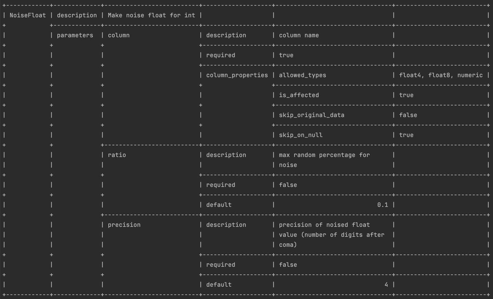

## show-transformer command

This command prints out detailed information about a transformer by a provided name, including specific attributes to
help you understand and configure the transformer effectively.

To show detailed information about a transformer, use the following command:

```shell
greenmask --config=config.yml show-transformer TRANSFORMER_NAME
```

Supported flags:

* `--format` — allows to select the output format. There are two options available: `text` or `json`. The
  default setting is `text`.

Example of `show-transformer` output:



When using the `show-transformer` command, you receive detailed information about the transformer and its parameters and
their possible attributes. Below are the key parameters for each transformer:

* `Name` — the name of the transformer
* `Description` — a brief description of what the transformer does
* `Parameters` — a list of transformer parameters, each with its own set of attributes. Possible attributes include:

    * `description` — a brief description of the parameter's purpose
    * `required` — a flag indicating whether the parameter is required when configuring the transformer
    * `link_parameter` — specifies whether the value of the parameter will be encoded using a specific parameter type
      encoder. For example, if a parameter named `column` is linked to another parameter `start`, the `start`
      parameter's value will be encoded according to the `column` type when the transformer is initialized.
    * `cast_db_type` — indicates that the value should be encoded according to the database type. For example, when
      dealing with the INTERVAL data type, you must provide the interval value in PostgreSQL format.
    * `default_value` — the default value assigned to the parameter if it's not provided during configuration.
    * `column_properties` — if a parameter represents the name of a column, it may contain additional properties,
      including:
        * `nullable` — indicates whether the transformer may produce NULL values, potentially violating the NOT NULL
          constraint
        * `unique` — specifies whether the transformer guarantees unique values for each call. If set to `true`, it
          means that the transformer cannot produce duplicate values, ensuring compliance with the UNIQUE constraint.
        * `affected` — indicates whether the column is affected during the transformation process. If not affected, the
          column's value might still be required for transforming another column.
        * `allowed_types` — a list of data types that are compatible with this parameter
        * `skip_original_data` — specifies whether the original value of the column, before transformation, is relevant
          for the transformation process
        * `skip_on_null` — indicates whether the transformer should skip the transformation when the input column value
          is NULL. If the column value is NULL, interaction with the transformer is unnecessary.

!!! warning

    The default value in JSON format is base64 encoded. This might be changed in later version of Greenmask.

```json title="JSON output example"
[
  {
    "properties": {
      "name": "NoiseFloat",
      "description": "Make noise float for int",
      "is_custom": false
    },
    "parameters": [
      {
        "name": "column",
        "description": "column name",
        "required": true,
        "is_column": true,
        "is_column_container": false,
        "column_properties": {
          "max_length": -1,
          "affected": true,
          "allowed_types": [
            "float4",
            "float8",
            "numeric"
          ],
          "skip_on_null": true
        }
      },
      {
        "name": "ratio",
        "description": "max random percentage for noise",
        "required": false,
        "is_column": false,
        "is_column_container": false,
        "default_value": "MC4x"
      },
      {
        "name": "decimal",
        "description": "decimal of noised float value (number of digits after coma)",
        "required": false,
        "is_column": false,
        "is_column_container": false,
        "default_value": "NA=="
      }
    ]
  }
]
```
